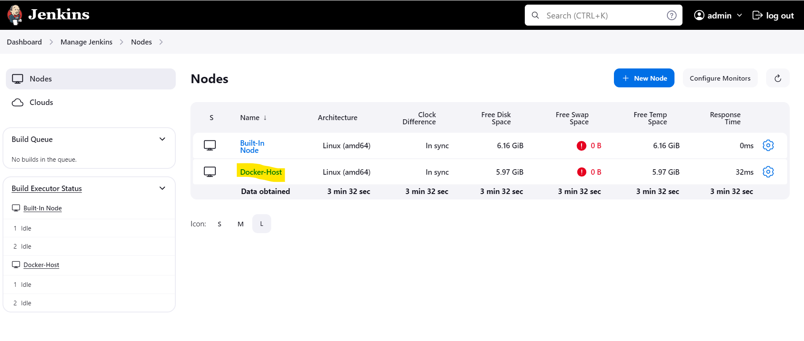
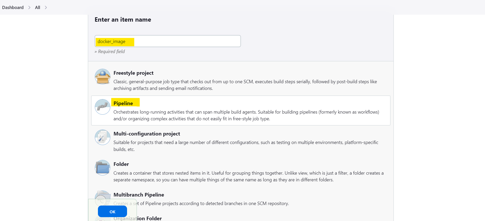

Deploy your code on a Docker Container using Jenkins on AWS

# Agenda :
* Build Docker images and pushing it to Docker Hub.
  * Launch EC2 Instance (Jenkins server).
  * Launch EC2 Instance for Node (Docker-Host).
  * Install Docker in Node.
  * setup jenkins in Jenkins server and create a Node.
  * write a Jenkins file to build and pushing Images to     DockerHub.

## Lauch EC2 Instance
* Log in to Amazon management Console , open EC2 Dashboard and Launch a Instance by giving the required details as shown below:

    * Click on Launch Instance.
    * Enter the instance **Name**.
    * Choose the AMI ( Amazon Machine Image) as per your convenience.
    * Choose Instance Type.
    * Give Key Pair.
    * Select security group.
    * Click on Launch instance.


* Launch a EC2 Instance, let's it be a worker node.


* Log in to the EC2 Instance (Node) and create a directory as shown below.


* Install java on worker node ( otherwise jenkins doesn't run on worker node ) by using below command:
```python
 sudo yum install fontconfig java-17-openjdk -y
```


Finally we got an instance as shown above and now Log in to the instance.

## Setup Docker on Node

* Run the install_docker.sh script to install the docker in Node( Docker-Host).

```python
sudo sh install_docker.sh
```


## Setup Jenkins Server on AWS EC2 Instance

* After logging in to EC2(Jenkins) machine install jenkins through below commands or for more info you can visit the official jenkins website: https://pkg.jenkins.io/redhat-stable/

```python
sudo wget -O /etc/yum.repos.d/jenkins.repo https://pkg.jenkins.io/redhat-stable/jenkins.repo

sudo rpm --import https://pkg.jenkins.io/redhat-stable/jenkins.io-2023.key
```


```python
sudo yum install fontconfig java-17-openjdk -y
```


```python
sudo yum install jenkins -y
```


Jenkins installed successfully. Now we need to start and enable the jenkins using below commands.
```python
sudo systemctl start jenkins

sudo systemctl enable jenkins

sudo systemctl status jenkins
```


* Now let’s try to access the Jenkins server through our browser. For that take the public IP of your EC2 instance and Jenkins runs on 8080 port number, so you need to paste it into your favorite browser like Public IP:Jenkins Port number (EX: 18.209.30.255:8080) then you can see the Jenkins UI as shown below:


* To get the access to the Jenkins for that we need to go the path /var/lib/jenkins/secrets/initialAdminPassword and fetch the Administrator password.
* Get that admin Password and unlock jenkins.


* Click on Install Suggested plugins:


* Now we can create our first Admin user, provide all the required data and proceed to save and continue.


* Click on save and Finish.


* Now Jenkins Server is ready to use.


## Create a Node in Jenkins
* Go to **Dashboar**d --> **Manage jenkins** --> **Node**


* Click on **New Node**


* Enter Node name and click on **create**


* Fill the required as shown below:
  * Root dir: Give root dir ( which we created in worker node ).
  * Lables: you can give any name.
  * Launch method: choose launch agents via SSH.
  * Host: Private IP of EC2 Instance (worker node).
  * Credentials: add your instance credentials and click on save.
  

* Now you can see the Node (Docker-Host) as shown below.
* Click on created Node and check the log whether it is connected to jenkins server or not.



* Let's create a pipeline --> switch to the Jenkins UI and in Dashboard click on **New Item**


* Enter name --> click on **pipeline** --> click **OK**



* Enter the pipeline details such as defination, SCM and git repository URL as shown below and **Click on apply & save**.


* To add Docker credentials, go to **Dashborad** --> **Manage Jenkins** --> **Credentials**


* Click on **System**


* Click on **Global Credentials**


* **Add Credentials**


* Enter the required details:
  * Scope: choose the scope from the dropdown as per your requirement.
  * Username: Enter the Docker Hub Username.
  * Password: Enter the Docker Hub Password.
  * ID: Give any name it's your choice (we should give this Id in Jenkinsfile)
  * Click on **Create**

